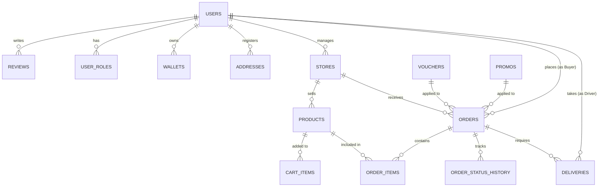

  

<h1 align="center">SEAPEDIA - System Architecture & Design</h1>

---

## 1. System Architecture Overview

SEAPEDIA follows a modern, decoupled **Client-Server Architecture** optimized for edge computing and high availability.

- **Frontend (Client):** A Single Page Application (SPA) built with React 18 and Vite. It runs entirely in the user's browser, fetching data asynchronously.
- **Backend (API Gateway & Services):** A serverless REST API built with Hono.js. It runs on Cloudflare Workers, which means the backend logic is executed at the "edge" (data centers physically closest to the user).
- **Database:** Cloudflare D1, a serverless SQLite database built on SQLite's highly durable storage layer, natively integrated with Cloudflare Workers.

## 2. Infrastructure & Networking

Because the backend uses the Cloudflare ecosystem, several enterprise-grade infrastructure components are automatically handled without manual setup:

### A. Load Balancing & CDN (Content Delivery Network)

- **Frontend CDN:** The built React application (`dist`) is deployed to a static hosting provider (e.g., Vercel, Netlify, or Cloudflare Pages). These providers automatically distribute the static assets (HTML, CSS, JS, Images) across a global CDN network.
- **Backend Load Balancing:** Cloudflare Workers inherently act as a global load balancer. Requests are routed to the nearest Cloudflare data center using Anycast routing, eliminating the need for a traditional centralized load balancer (like NGINX or AWS ALB).

### B. Caching

- **Static Assets:** Cached aggressively at the CDN edge nodes.
- **API Responses:** Caching can be applied at the Cloudflare Worker level using the Cache API or KV (Key-Value) store for frequently accessed public data, like the product catalog (`GET /products`).

## 3. Security (Task Level 7 Hardening)

SEAPEDIA implements robust security measures across both the frontend and backend to protect the marketplace:

### A. Authentication & Authorization (RBAC)

- **Stateless Authentication:** Uses JSON Web Tokens (JWT). The token is signed using `HS256` with a strong secret (`JWT_SECRET`). It contains the user's ID, email, and roles.
- **Password Hashing:** Passwords are never stored in plain text. They are hashed using **Bcrypt** with a sufficient salt round.
- **Role-Based Access Control (RBAC):** Users can own multiple roles (Buyer, Seller, Driver). The frontend explicitly sends the "Active Role" being used in the session. The backend verifies that the user actually owns this role and protects endpoints using role-guard middleware.

### B. Prevention of Vulnerabilities

- **SQL Injection (SQLi) Prevention:** Drizzle ORM acts as a secure query builder. All database queries use parameterized statements internally, completely mitigating SQL injection payloads.
- **Cross-Site Scripting (XSS) Prevention:** React automatically sanitizes and escapes all text rendered in the DOM. User-generated content (like public application reviews) cannot execute malicious `<script>` tags.
- **Input Validation:** Zod is used on the backend to rigorously validate all incoming request bodies (email formats, password strength, positive stock numbers, valid UUIDs) before touching the database.

## 4. CI/CD (Continuous Integration / Continuous Deployment)

- **Frontend:** Vercel (or Cloudflare Pages) automatically triggers a new build pipeline whenever a commit is pushed to the `main` branch. It executes `npm run build` and deploys the new assets immutably.
- **Backend:** Can be automated using GitHub Actions. A workflow can be configured to run `pnpm run deploy` upon push, securely injecting the `JWT_SECRET` using GitHub Secrets into the Cloudflare Worker environment.

## 5. Database Entity Relationship Diagram (ERD)

The database follows a relational model. Below is the simplified Entity Relationship structure:

### Core Entities:

1. **Users:** Central entity containing authentication credentials.
2. **User Roles:** Maps users to `ADMIN`, `BUYER`, `SELLER`, or `DRIVER`.
3. **Stores:** Unique storefronts managed by Sellers.
4. **Products:** Items listed by Stores.
5. **Orders & Order Items:** Transactional records linking Buyers, Stores, and Products.
6. **Deliveries:** Routing and job records for Drivers assigned to specific Orders.
7. **Wallets & Wallet Transactions:** Tracks financial balances (Top Ups, Payments, Earnings, Commissions).
8. **Vouchers & Promos:** Discount configurations managed by Admins.
